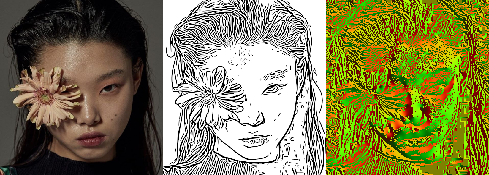

## Coherent Line Drawing

An implementation of 'Coherent Line Drawing' by Kang et al, Proc. NPAR 2007 . 

forked from [SSARCandy/Coherent-Line-Drawing](https://github.com/SSARCandy/Coherent-Line-Drawing})

## Modifications

I added a cli version : CLD-cli to process Coherent Line Drawing without gui

The original gui is called CLD-gui

tested on KDE Neon bionic (Ubuntu 18.04)

## Build

`sudo apt install libwxgtk3.0-dev` (Ubuntu 18.04) 

`cd path/to/Coherent-Line-Drawing`

`mkdir build;cd build`

`cmake`

`make`

### Requirement

- OpenCV (prefer 3.0 or higher)
- wxwidget (prefer 3.0 or higher)
- cmake

### Documentation

- [Original academic paper](http://citeseerx.ist.psu.edu/viewdoc/download?doi=10.1.1.108.559&rep=rep1&type=pdf)
- [Introduction in Chinese](https://ssarcandy.tw/2017/06/26/Coherent-Line-Drawing/)

> This paper presents a non-photorealistic rendering technique that
automatically generates a line drawing from a photograph.

## Workflow(youtube video)

### Environment

It should work fine in Windows/Linux/MacOS.  
But I only tested it in Windows and macOS.

### Pre-Build Version

You can download pre-build version at [here](https://github.com/SSARCandy/Coherent-Line-Drawing/releases).  
Including Windows and macOS versions.

## Screenshot

